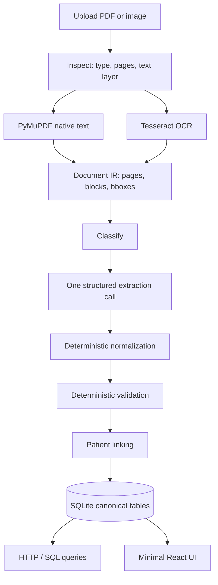

# UnstructRestruct

Turn messy medical documents into structured, queryable data.

This is a **job-assignment MVP**, not a clinical product. It demonstrates a pipeline: local extraction → classification → schema-constrained extraction → deterministic normalization/validation → patient linking → SQL queries. The LLM is one stage, not the system.

Do not upload real patient records.

## Problem

Unstructured PDFs and scans (labs, prescriptions, diagnostic reports) are not queryable. Asking a model questions about the original file does not produce a durable, auditable dataset. The system converts documents into canonical rows you can filter, join, and review.

## What the system does

1. Accepts a PDF or image.
2. Inspects whether a native text layer exists.
3. Extracts text with PyMuPDF, or Tesseract if the file is scanned. Phone photos and weak Tesseract results fall back to the vision model when an API key is set.
4. Stores an intermediate page representation (text + blocks).
5. Classifies: lab report, prescription, diagnostic report, or unknown.
6. Extracts typed fields (null if absent — no invented units or ranges).
7. Normalizes dates, units, and test/medication names while keeping raw values.
8. Validates deterministically (conflicts, unparseable numbers, broken ranges).
9. Links to a patient using IDs and DOB first; similar names without evidence stay unmerged and flagged.
10. Serves SQL-backed queries and a small UI.

## Architecture



## Pipeline statuses

`UPLOADED` → `TEXT_EXTRACTED` or `OCR_COMPLETED` → `CLASSIFIED` → `EXTRACTED` → `NORMALIZED` → `VALIDATED` → `LINKED` → `COMPLETED`

Failure / review states include `OCR_FAILED`, `EXTRACTION_FAILED`, `VALIDATION_FAILED`, `LINKING_AMBIGUOUS`, `NEEDS_REVIEW`. They are stored on the document, not collapsed into a generic “failed.”

## Technology

| Area | Choice |
| --- | --- |
| API | Python, FastAPI, Pydantic |
| DB | SQLite + SQLAlchemy |
| PDF | PyMuPDF |
| OCR | Tesseract (local) |
| LLM | OpenAI structured outputs, optional stub |
| UI | React, TypeScript, Vite |

## How to run locally

### Prerequisites

- Python 3.11+
- Node 16+ (18+ recommended)
- [Tesseract](https://github.com/tesseract-ocr/tesseract) only if you want scanned/image documents (`02_scanned_lab_aarav.pdf`). Text-layer PDFs work without it.

Windows: install Tesseract and optionally set `TESSERACT_CMD` in `.env` to the `tesseract.exe` path.

### Backend

```bash
cd backend
python -m venv .venv
# Windows: .venv\Scripts\activate
# macOS/Linux: source .venv/bin/activate
pip install -r requirements.txt
python -m scripts.generate_samples
uvicorn app.main:app --reload --port 8000
```

### Frontend (dev, hot reload)

```bash
cd frontend
npm install
npm run dev
```

Open http://localhost:5173. The Vite dev server proxies API calls to port 8000.

### One process (production-style local)

Build the UI, then let FastAPI serve it on port 8000:

```bash
cd frontend
npm install
npm run build

cd ../backend
uvicorn app.main:app --reload --port 8000
```

Open http://localhost:8000.

### Docker (same image Railway will run)

```bash
docker compose up --build
```

Open http://localhost:8000. Pass `OPENAI_API_KEY` in `.env` if you want real extraction; otherwise the stub runs.

### Tests

From the repository root, with backend dependencies installed:

```bash
cd backend
pip install -r requirements.txt
cd ..
pytest
```

## Environment variables

Copy `.env.example` to `.env`.

| Variable | Purpose |
| --- | --- |
| `GEMINI_API_KEY` | Preferred LLM for this assignment. Vision OCR fallback + structured extract |
| `GEMINI_MODEL` | Default `gemini-flash-latest` (cheap Flash) |
| `OPENAI_API_KEY` | Used when Gemini is unset and `LLM_MODE` is `openai` or `auto` |
| `OPENAI_MODEL` | Default `gpt-4o-mini` |
| `LLM_MODE` | `auto` (Gemini, else OpenAI, else stub), `gemini`, `openai`, or `stub` |
| `DATABASE_URL` | Default `sqlite:///./data/app.db` |
| `UPLOAD_DIR` | Default `./data/uploads` |
| `TESSERACT_CMD` | Optional path to the Tesseract binary. Default looks in `C:\Program Files\Tesseract-OCR\tesseract.exe` |
| `CORS_ORIGINS` | Comma-separated origins, or `*` in Docker/Railway |
| `DEMO_PATIENT_PASSWORD` | Fallback password for clinicians and for patients created by document linking (no stored password yet). Default `demo` |

The stub extractor is for CI and for running sample PDFs without a key. It is not a substitute for the model on arbitrary messy documents.

## Patient vs clinician (the product use case)

The pipeline still turns messy documents into queryable records. The UI is a **patient-controlled share** for a family doctor:

1. Upload sample PDFs (e.g. `01` then `03` then `09` for Aarav).
2. Choose **I am a patient**. Sign in with a **username** and password. Name and phone identify the person; username is only for login. Known sample username `PAT-1001` uses password `demo`. An unknown username creates a new chart. Uploads show extracted text and must be confirmed; confirm copies name/phone onto the chart and files the document.
3. **Timeline** groups records by date and expands with a short description.
4. **Share access** generates a 24-hour code. Give the clinician your username plus the code. A new code expires the old one; **Revoke** drops clinician access.
5. Switch role → healthcare professional. Known demo ID `DOC-1001` uses password `demo`. Add the patient’s **username** plus the code.
6. The clinician list, documents, queries, and uploads are limited to those shared patients.

## Railway (public URL)

The repo is set up for one service: `Dockerfile` + `railway.toml`. Railway builds the UI, installs Tesseract, and serves FastAPI + the static app on `$PORT`.

1. [railway.app](https://railway.app) → **New Project** → **Deploy from GitHub repo** → `Sauravskv07/UnstructRestruct` (or your fork). Leave the root directory empty.
2. Open the service → **Settings** → **Networking** → **Generate Domain**. That URL is the site.
3. **Variables** → add `GEMINI_API_KEY` (same value as local `.env`). Optional: `GEMINI_MODEL=gemini-flash-latest`. Do not commit the key.
4. Wait for the deploy to go healthy (`GET /health`). Share the generated domain.

You do **not** need to set `PORT`, `DATABASE_URL`, `UPLOAD_DIR`, or `CORS_ORIGINS` unless you want to override the image defaults. Keep **one replica** (SQLite).

Optional: add a volume mounted at `/data` so the database and uploads survive redeploys. Without a volume, a new deploy starts with an empty chart.

Do not upload real patient records to the public URL. Free tiers may cold-start slowly.

## How to upload / process a document

1. Start the API (and UI on `:8000` after `npm run build`, or Vite on `:5173`).
2. Use **Upload** and choose a file from `sample_documents/`.
3. `POST /documents` stores the file and returns an id with status `PROCESSING`. The pipeline runs in the background; poll `GET /documents/{id}` or the documents list. Confirm when status is `PENDING_CONFIRMATION`.
4. Inspect extracted text (pre-LLM), canonical JSON, validation, provenance, and the stage log.
5. Reprocess via `POST http://localhost:8000/documents/{id}/reprocess` if you change prompts or code.

## Example structured output

From `01_clean_lab_aarav.pdf` (shape, not a guaranteed byte-for-byte stub dump):

```json
{
  "document_type": "lab_report",
  "patient": {
    "name": "Aarav Sharma",
    "patient_id": "PAT-1001",
    "date_of_birth": "1988-03-14"
  },
  "date": "2026-07-12",
  "tests": [
    {
      "raw_name": "Haemoglobin",
      "canonical_name": "hemoglobin",
      "raw_value": "13.2",
      "value": 13.2,
      "unit": "g/dL",
      "reference_range": { "low": 13.0, "high": 17.0 },
      "abnormal_flag": null,
      "provenance": {
        "document_id": "…",
        "page": 1,
        "source_text": "Haemoglobin          13.2       g/DL     13.0 - 17.0"
      }
    }
  ]
}
```

`g/DL` is normalized to `g/dL`. The raw line is kept.

## Example validation failure

Upload `06_inconsistent_lab.pdf`. The same canonical test `hemoglobin` appears as 13.2 and 8.1. The document is `NEEDS_REVIEW` with code `inconsistent_values`. Neither value is dropped or “corrected.”

## Example patient linking

- `01_clean_lab_aarav.pdf` and `03_prescription_aarav.pdf` share `PAT-1001` → one patient, chronological list on the patient page.
- `07_lab_priya.pdf` (`Priya Nair` + DOB) and `08_rx_p_nair.pdf` (`P. Nair`, no DOB/ID) stay **separate** with `needs_review` / ambiguous linking. Names that merely look similar are not merged.

## Example queries

These read tables, not PDFs:

- `GET /patients/{id}` — documents in date order
- `GET /patients/{id}/lab-results?test=hemoglobin` — hemoglobin over time
- `GET /patients/{id}/medications`
- `GET /query/lab-results?validation_status=validation_failed`
- `GET /query/needs-review`
- `GET /query/medications`

The timeline page searches this chart: date range, lab test, medication, or diagnostic, using canonical name pickers. Results are tables or a filtered timeline, each row linking to the source document.

## Sample documents

Generated by `python -m scripts.generate_samples` from `backend/`:

| File | What it shows |
| --- | --- |
| `01_clean_lab_aarav.pdf` | Clean text-layer lab |
| `02_scanned_lab_aarav.pdf` | Image-only PDF / OCR path |
| `03_prescription_aarav.pdf` | Same patient as 01 |
| `04_messy_lab.pdf` | Messy labels and units |
| `05_missing_fields_rx.pdf` | Nulls instead of invented fields |
| `06_inconsistent_lab.pdf` | Conflicting hemoglobin values |
| `07_lab_priya.pdf` | HbA1c 7.8 with **no** unit invented |
| `08_rx_p_nair.pdf` | Ambiguous patient match |
| `09_diagnostic_aarav.pdf` | Diagnostic report on the same timeline |

## Known limitations

- Numeric dates are parsed day-first (`12/07/2026` → 12 July 2026). US-style `MM/DD` can be wrong.
- Medication and lab alias lists are small; unknown names are lowercased, not mapped to RxNorm/LOINC.
- LLM confidence is not a calibrated probability.
- OCR uses Tesseract first; photos and weak scans can fall back to the vision model when an API key is set. Handwriting is still imperfect.
- Upload returns immediately; OCR/LLM still run in-process on a background task. Large packets of pages would need chunking beyond the current 12k-character cap sent to the model.
- No access control. The hosted demo is still unauthenticated.

## What was deliberately left out

Authentication, Kubernetes, microservices, vector search, knowledge graphs, diagnosis, treatment advice, a full EHR UI, and vendor document-AI platforms. A single Docker/Railway service exists only so evaluators can open a URL. See `decision.md`.

## Repository layout

```
backend/app/          API, DB, pipeline services
frontend/           Minimal React UI
tests/              Normalization, validation, linking, extraction, e2e stub
sample_documents/   Synthetic PDFs
decision.md         Engineering judgment
```
